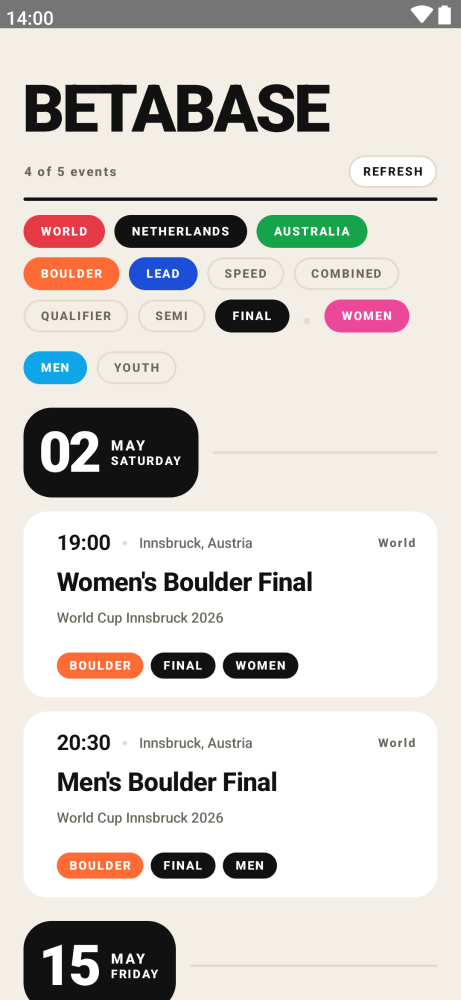
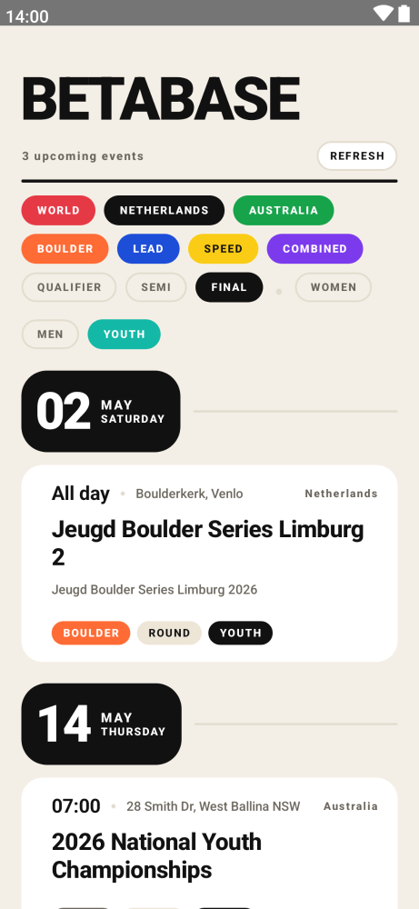
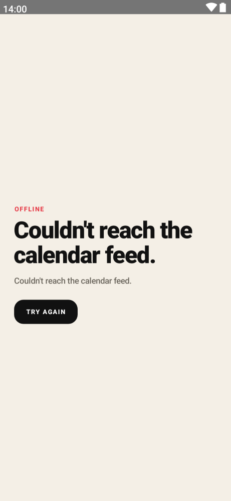

# Betabase

Upcoming sport climbing competitions, in your pocket.

A Jetpack Compose Android app that aggregates climbing competitions from multiple sources into a single, filterable list.

<p align="center">
  
  
  
</p>

## Sources

- **IFSC** (`World`) — live ICS feed from `calendar.ifsc.stream` covering World Cups, World Championships, Continental Cups, etc. Refreshed on app launch and pull-to-refresh.
- **NKBV** (`Netherlands`) — Dutch federation national + regional series, scraped from `was2.shiftf5.nl/competitions`. Bundled JSON, refreshed by re-running the scraper and shipping a new app version.
- **SCA** (`Australia`) — Sport Climbing Australia upcoming events from `sportclimbingaustralia.org.au/Upcoming-Events`. Bundled JSON, same refresh model as NKBV.

## Features

- Region toggle chips (`World` / `Netherlands` / `Australia`) — all on by default.
- Discipline chips (`Boulder`, `Lead`, `Speed`, `Combined`) — Boulder + Lead on by default.
- Round chips (`Qualifier`, `Semi`, `Final`) — Final only by default.
- Audience chips (`Women`, `Men`, `Youth`) — Women + Men on by default; Youth detection via title keywords (`jeugd`, `youth`, `junior`, `u14`–`u20`).
- Tap a card to open the source's event page (livestream player on IFSC events; registration / detail page on NKBV and SCA) — uses Compose's `LocalUriHandler`.
- Pull-to-refresh fetches the live IFSC feed; bundled sources reload from assets.

## Build

Requirements:
- JDK 17
- Android SDK with platforms 35 + build-tools

```bash
./gradlew :app:installDebug
```

The Gradle wrapper handles itself. `local.properties` should point to your Android SDK (auto-generated by Android Studio on first open).

## Architecture

- `data/EventSource` — the plug-in interface. Implementations: `IfscEventSource` (live HTTP + ICS parser) and `BundledJsonEventSource` (reads `app/src/main/assets/*.json`).
- `data/IcsParser` — RFC 5545 line-unfolding ICS parser, TZID-aware. Stdlib only.
- `data/EventClassifier` — title keyword → `(Gender, Discipline, Round)`. Multilingual for the gender/youth axis (English + Dutch).
- `data/CompetitionsRepository` — fans out to all sources in parallel, merges, filters past events, sorts by start time.
- `ui/screens/CompetitionsViewModel` — flat `CompetitionsUiState` with `CompetitionsFilters`. `Factory` registers all sources via `APPLICATION_KEY`.
- `ui/theme` — custom design system (`BetabaseColors`/`Typography`/`Shapes`) on `CompositionLocal`s. No `MaterialTheme`.
- `ui/components` — `BetaText`, `BetaCard`, `BetaPill`, `BetaChip`, `BetaButton`, `CompetitionCard`. Built from `androidx.compose.foundation` only.

## Adding a new data source

The two patterns:

**Live HTTP feed (IFSC-style):** Implement `EventSource`. Fetch in `Dispatchers.IO`, parse, return `List<CompetitionEvent>`. Add a value to `SourceTag` with a `regionLabel`. Register in `CompetitionsViewModel.Factory`. Done — chip and per-card label appear automatically.

**Scraped bundled JSON (NKBV / SCA-style):**
1. Drop a Python scraper into `scripts/` (gitignored). Stdlib-only is encouraged. Output to `app/src/main/assets/<source>_competitions.json` matching this schema:
   ```json
   {
     "source": "...", "source_url": "...", "fetched_at": "ISO-Z",
     "events": [
       { "id": "...", "title": "...", "series": null,
         "location": "...", "date": "YYYY-MM-DD", "time": "HH:MM" | null,
         "discipline": "Boulder" | null, "url": "..." }
     ]
   }
   ```
2. Add the value to `SourceTag` with a `regionLabel`.
3. In `CompetitionsViewModel.Factory`, add a `BundledJsonEventSource(app, "<file>.json", SourceTag.X)`.
4. In `CompetitionsScreen.sourceColor` / `sourceOnColor`, give the new region a chip color.
5. Bump `versionCode` in `app/build.gradle.kts` before releasing.

## Refreshing scraped data

```bash
python3 scripts/scrape_nkbv.py
python3 scripts/scrape_sca.py
# review the diff in app/src/main/assets/*.json, then bump versionCode and release
```

The scraper scripts themselves are gitignored — they're operator tooling, not shipped code. The JSON they produce is committed.

## Release

Tagging `v*` triggers `.github/workflows/release.yml`:
- **`apk` job** — builds a signed APK and attaches it to a GitHub release.
- **`play-store` job** — builds an AAB and uploads it to the Play Store production track via fastlane. Gated on the `PLAY_STORE_ENABLED` repo variable so it stays off until the Play Console + service account are ready.

Required GitHub Actions secrets:

| Secret | Purpose |
|---|---|
| `KEYSTORE_B64` | base64-encoded release keystore (`base64 -i keystore.jks`) |
| `KEYSTORE_PASSWORD` | keystore + key password |
| `KEY_ALIAS` | key alias inside the keystore |
| `PLAY_STORE_KEY_JSON` | base64-encoded Play Store API service-account JSON (only needed when enabling the play-store job) |

Local signed builds:

```bash
export KEYSTORE_FILE=/path/to/keystore.jks
export KEYSTORE_PASSWORD=...
export KEY_ALIAS=...
./gradlew :app:assembleRelease   # APK
./gradlew :app:bundleRelease     # AAB
```

The signing config in `app/build.gradle.kts` falls back to debug-signing when no keystore is found, so unsigned local builds still work for development.

## Screenshot tests

Paparazzi tests live in `app/src/test/kotlin/.../screenshots/`. Snapshots are committed under `app/src/test/snapshots/images/`.

```bash
./gradlew :app:verifyPaparazziDebug    # CI mode: fail on visual diff
./gradlew :app:recordPaparazziDebug    # rewrite snapshots after intentional changes
./gradlew :app:updateScreenshots       # also copies labelled PNGs into media/
```

Add new snapshots by writing a `@Test` in `ScreenshotTest.kt` that calls `snap { CompetitionsScreenContent(state = …, on… = {}) }` with hand-built `CompetitionsUiState`. Map the test name to a media filename inside the `updateScreenshots` task in `app/build.gradle.kts`.

## License

MIT — see [LICENSE](LICENSE).
